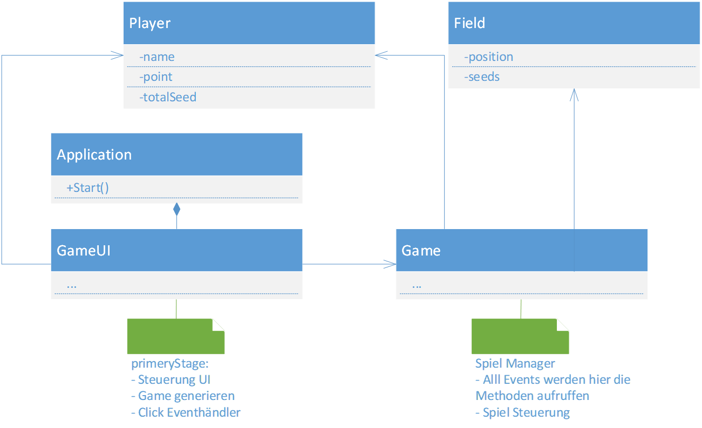

## Oware Game

**Project and Training 1
Java**

this project was made without using fxml or javafx tools like sceneBuilder because it was not allowed for us.

Gruppe:5

Start das Spiel mit: GameUI.java

## Game Over
**Wenn 2 Kugeln auf den Spielfeldern sind**
*  Das Spiel wird beendet!

**Wenn 4 Kugeln auf den Spielfeldern sind**

* **Exits Strategie** 
1. Das Spiel wird sofort beendet
1. Jeder Spieler darf die Kugeln von Spielfeldern des Gegenspielers wegnehmen, falls dort mehr als eine Kugel ist.
1. Der Spieler darf aber nicht alle Kugeln wegnehmen, es soll eine Kugel auf den Spielfeldern des Gegenspielers bleiben.
1. Das Spiel wird beendet!

## UML unseres Games

## Robot unseres Games

## Beispiel: playing with the computer

## Beispiel: playing with 2 Player

